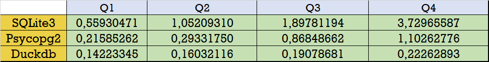
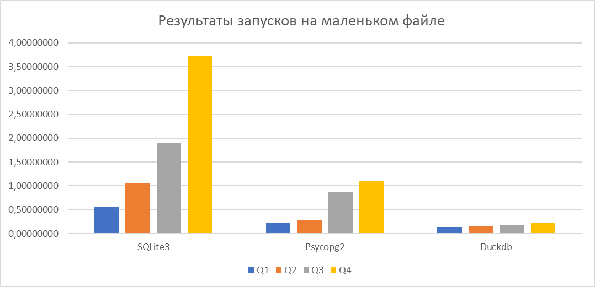
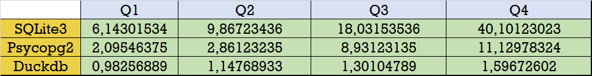
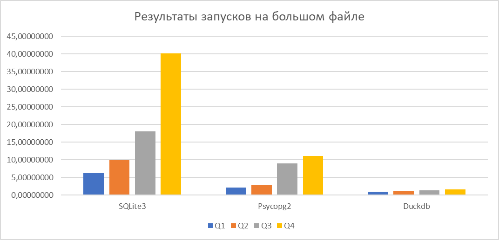

# Benchmark

## Оглавление

- [1. Что такое бенчмарк?](#1-что-такое-бенчмарк)
- [2. Запуск кода](#2-запуск-кода)
- [3. Реализация](#3-реализация)
  - [3.1 Основной скрипт](#31-основной-скрипт)
  - [3.2 Запуски](#32-запуски)
  - [3.3 Модули](#33-модули)
- [4. Вывод](#4-вывод)

***

## 1. Что такое бенчмарк?

`Бенчмаркинг баз данных` - это проверенный и четко определённый метод анализа и сравнения характеристик производительности баз данных или систем управления базами данных (СУБД). 
**_Основные задачи бенчмарка_:**
* **_Оценка производительности:_** помогает оценить скорость работы системы, ПО или компонентов.
* **_Сравнение систем:_** позволяет сравнивать производительность разных систем или компонентов в одинаковых условиях.
* **_Измерение улучшений:_** позволяет оценить эффективность изменений, таких как обновления программного или аппаратного обеспечения.
* **_Стандартизированные тесты:_** предоставляет набор стандартизированных тестов для объективного сравнения производительности.
* **_Определение базовой производительности:_** служит отправной точкой для понимания производительности системы и ее способности справляться с задачами.
* **_Принятие решений:_** помогает принимать обоснованные решения на основе количественных данных о производительности.

### Benchmark "4 queries"

Рассмотрим и реализуем на языке `Python` бенчмарк под названием **"4 queries"**. Pассмотрим в проекте ряд библиотек для работы с базами данных:

* [sqlite3](https://docs.python.org/3/library/sqlite3.html)
* [psycopg2](https://www.psycopg.org/docs/)
* [duckdb](https://duckdb.org/docs/)

### Проверяемые запросы

1. Этот запрос выполняет подсчёт кол-ва записей в таблице `trips` для каждого уникального значения столбца `VendorID` и группирует результаты по типу такси (`VendorID`).

```SQL
SELECT "VendorID", COUNT(*) FROM "trips" GROUP BY 1;
```

2. Этот запрос выполняет вычисление среднего значения стоимости поездки (`total_amount`) для каждого уникального значения числа пассажиров (`passenger_count`) в таблице `trips`.

```SQL
SELECT "passenger_count", AVG("total_amount") FROM "trips" GROUP BY 1;
```

3. Этот запрос извлекает информацию из таблицы `trips` о кол-ве пассажиров (`passenger_count`), годе по времени взятия такси (`tpep_pickup_datetime`), и подсчитывает кол-во записей, соответствующих каждому уникальному значению комбинации числа пассажиров и года взятия такси.

```SQL
SELECT "passenger_count", EXTRACT(year FROM "tpep_pickup_datetime"), COUNT(*)
FROM "trips" GROUP BY 1, 2;
```

4. Этот запрос извлекает информацию из таблицы trips о кол-ве пассажирор (`passenger_count`), годе по времени взятия такси (`tpep_pickup_datetime`), округлённой дистанции поездки (`trip_distance`) и подсчитывает кол-во записей для каждой уникальной комбинации этих параметров. Результаты сортируются по году взятия такси в порядке возрастания, а кол-во записей в каждой группе упорядочивается по убыванию.

```SQL
SELECT "passenger_count", EXTRACT(year FROM "tpep_pickup_datetime"), ROUND("trip_distance"),
COUNT(*) FROM "trips" GROUP BY 1, 2, 3 ORDER BY 2, 4 DESC;
```

## 2. Запуск кода

1. Скачайте по необходимости все библиотеки, используемые в данном бенчмарке, с помощью команды `pip install` + название модуля. Модуль **sqlite3** устанавливать не надо - он является встроенным в стандартную библиотеку Python.
2. Склонируйте репозиторий и создайте папку `data`, где будут храниться все исходники.
3. Скачайте файлы `nyc_yellow_tiny.csv`, `nyc_yellow_big.csv` и поместите их в папку `data`. Ссылка на файлы [тут](https://drive.google.com/drive/folders/1usY-4CxLIz_8izBB9uAbg-JQEKSkPMg6)
4. Для настройки запуска кода откройте файл `config.py` и заполните все пустые поля - название файла с данными, данные для подключения к PostgreSQL и др.
5. Откройте файл `main.py` и запустите его;
> [!NOTE]
> В исходных файлах содержится ошибка. В таблице два последних столбца имеют одинаковое название, что приводит к ошибке дубликатов. Для решения проблемы последний столбец был удалён.

### Файл конфигурации

```py
TRIALS = 10

# Info to connect to PostgreSQL
name_database = ""
username = ""
password = ""
hostname = ""
port = ""

# File name with data
dataset = ""

# Queries for modules
COUNT = 4
queries = {
    "sqlite3": [
        f"""SELECT "VendorID", COUNT(*)
        FROM "trips" GROUP BY 1;""",
        f"""SELECT "passenger_count", AVG("total_amount")
       FROM "trips" GROUP BY 1;""",
        f"""SELECT "passenger_count", STRFTIME('%Y', "tpep_pickup_datetime"), COUNT(*)
       FROM "trips" GROUP BY 1, 2;""",
        f"""SELECT "passenger_count", STRFTIME('%Y', "tpep_pickup_datetime"), ROUND("trip_distance"), COUNT(*)
       FROM "trips" GROUP BY 1, 2, 3 ORDER BY 2, 4 DESC;""",
    ],
    "psycopg2": [
        f"""SELECT "VendorID", COUNT(*)
        FROM "trips" GROUP BY 1;""",
        f"""SELECT "passenger_count", AVG("total_amount")
       FROM "trips" GROUP BY 1;""",
        f"""SELECT "passenger_count", EXTRACT(year FROM "tpep_pickup_datetime"), COUNT(*)
       FROM "trips" GROUP BY 1, 2;""",
        f"""SELECT "passenger_count", EXTRACT(year FROM "tpep_pickup_datetime"), ROUND("trip_distance"), COUNT(*)
       FROM "trips" GROUP BY 1, 2, 3 ORDER BY 2, 4 DESC;""",
    ],
    "duckdb": [
        f"""SELECT "VendorID", COUNT(*)
        FROM "trips" GROUP BY 1;""",
        f"""SELECT "passenger_count", AVG("total_amount")
       FROM "trips" GROUP BY 1;""",
        f"""SELECT "passenger_count", EXTRACT(year FROM "tpep_pickup_datetime"), COUNT(*)
       FROM "trips" GROUP BY 1, 2;""",
        f"""SELECT "passenger_count", EXTRACT(year FROM "tpep_pickup_datetime"), ROUND("trip_distance"), COUNT(*)
       FROM "trips" GROUP BY 1, 2, 3 ORDER BY 2, 4 DESC;""",
    ],
}

# Dictionary to connect to PostgreSQL
params = {
    "dbname": name_database,
    "user": username,
    "password": password,
    "host": hostname,
    "port": port,
}

# Modules
sqlite3 = True
psycopg2 = True
duckdb = True
```
``

## 3. Реализация

### 3.1 Основной скрипт

```py
from sqlalchemy import create_engine
import pandas as pd
from sqlite3 import connect
from config import *

import psycopg2_bench as DB_psycopg2
import sqlite3_bench as DB_sqlite3
import duckdb_bench as DB_duckdb

# Reading data from dataset
# ------------------------------------------------------------------------------
df = pd.read_csv(f"data\\{dataset}")
df = df.drop(columns=["Airport_fee"])
df["tpep_pickup_datetime"] = pd.to_datetime(df["tpep_pickup_datetime"])
df["tpep_dropoff_datetime"] = pd.to_datetime(df["tpep_dropoff_datetime"])
df = df.rename(columns={"Unnamed: 0": "id"})
# ------------------------------------------------------------------------------

# Insert data in PostgreSQL
# ------------------------------------------------------------------------------
path = f"postgresql://{username}:{password}@{hostname}:{port}/{name_database}"
engine = create_engine(path)
df.to_sql("trips", engine, if_exists="replace", index=False, chunksize=10000)
engine.dispose()
# ------------------------------------------------------------------------------


# Insert data in SQLite
# ------------------------------------------------------------------------------
con = connect(f"data\\database.db")
df.to_sql("trips", con, if_exists="replace", index=False, chunksize=10000)
con.close()
# ------------------------------------------------------------------------------


# Run queries
# ------------------------------------------------------------------------------
if sqlite3: print("SQLite3:", *DB_sqlite3.run())
if psycopg2: print("Psycopg2:", *DB_psycopg2.run())
if duckdb: print("Duckdb:", *DB_duckdb.run())
# ------------------------------------------------------------------------------

```

Основной скрипт `main.py` помогает загрузить всю информацию (с помощью чтения `.csv` через `pandas`), необходимую для запуска, в базы данных PostgreSQL и SQLite, а также вызывает внутри себя функции для замера времени выполнения запросов. Для каждой из 3-х библиотек заведён свой файл `.py`, внутри которого написана функция `run` для тестирования. Тестирование одного запроса проводилось **10 раз**. После этого в `Excel` были построены графики для полученных результатов.

### 3.2 Запуски

* Результаты на файле `nyc_yellow_tiny.csv`:





* Результаты на файле `nyc_yellow_big.csv`:





### 3.3 Модули

#### SQLite3


**_SQLite_** – это легковесная реляционная база данных, отличающаяся своей производительностью и небольшим размером. Она является мощным инструментом для хранения данных. SQLite хранит все данные в локальном файле `.db`, что позволяет не зависеть от удаленного сервера баз данных, и поддерживает стандартные для SQL операции. В целом, `SQLite3` - это весьма лёгкая в использовании _встроенная_ библиотека Python. Что касается производительности, то данная библиотека показала самые плохие результаты и отстаёт от других модулей в разы, что видно из обоих графиков, особенно по сравнению с `duckdb`. Несмотря на свои ограничения, SQLite в основном применяется в работе с мобильными приложениями, что делает ее весьма популярной в настоящее время.

#### Psycopg2


Cтоит отметить, что **_Psycopg2_** — это популярная библиотека для работы с `PostgreSQL`, которая позволяет выполнять различные действия с использованием   `Python`. Этот модуль обладает множеством различных функций для создания, изменения, чтения таблиц и выполнения SQL-запросов. Он также поддерживает транзакции и загрузку данных из csv-файла. По скорости работы данная библиотека занимает второе место и уступает лишь _duckdb_. Это может быть связано с особенностями системы транзакций. Тем не менее, PostgreSQL сама по себе является весьма оптимизированной СУБД. Это приводит к выводу, что в данной работе были рассмотрены не все возможности данной СУБД и данной библиотеки. Возможно, это бы повлияло на замеренное время.

#### DuckDB


**_DuckDB_** — это SQL-встраиваемая `OLAP-система` управления базами данных. Это реляционная СУБД, поддерживающая SQL. `DuckDB` не имеет внешних зависимостей и серверного программного обеспечения. Это полностью встроенная система, что обеспечивает быструю передачу данных в базу данных и из неё. Модуль `duckdb` проявил себя как самый быстрый среди всех библиотек, опережая другие в разы. Он обладает широким спектром функций и позволяет легко управлять данными. В результате краткого обзора можно сделать вывод, что Duckdb хорошо подходит для интерактивного анализа данных и выполнения сложных вычислений с большими объёмами данных. Его высокая производительность достигается за счёт векторизации выполнения запросов (ориентации на столбцы).

***

## 4. Вывод

В работе был написан бенчмарк для проверки 3 модулей `Python`: _sqlite3_, _psycopg2_ и _duckdb_. Подводя итог, хочется сказать, что каждая библиотека показала достойные результаты и каждая из них имеет свои "+" и "-". Библиотека **duckdb** показала лучшую производительность, что объясняется ее специализацией на аналитические запросы с большими объемами данных. **psycopg2** заняла второе место и уступила duckDB в несколько раз из-за особенностей структуры PostgreSQL. Несмотря на простоту в использовании, **sqlite3** же показала самый низкий результат из-за неоптимизированной работы с большими объёмами данных, преобразование запросов и использование индексации столбцов могут улучшить ее производительность.